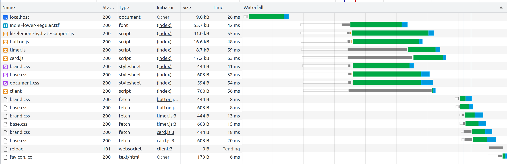
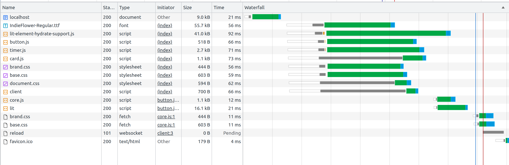

# Web Component isolation and performance prototype

This is a prototype which aim to explore how we can build web components with high loading performance while utilizing reusability.

Main goals we want to achieve is:

 * The Web Components should have a shadow DOM for encapsulation
 * The Web Components should be able to live standalone without depending on anything in the document they are used in
 * The Web Components should be able to reuse styles between them without duplicating them inline
 * There should be no FOUC 

## Run the prototype

Install dependencies and start the server:

```sh
~/ npm install
~/ npm start
```

Then go to http://localhost:3000

## Remove FOUC of Web Components

This prototype uses the Declarative Shadow DOM (DSD) to prevent FOUC of the Web Components. This requires server side rendering of the Lit based Web Components and is done by the SSR module from Lit.

FireFox is the only browser not supporting DSD at the moment. For DSD support in FireFox the [following polyfill](https://github.com/web-platform-tests/wpt/blob/master/resources/declarative-shadow-dom-polyfill.js) is being used. This polyfill will also append DSD to all child Web Components of the "top" Web Component.

The polyfill is slightly altered in a way so its added as a global function on `window.dsd` in the document. Then after each "top" Web Component in the document we only need to call the function to apply DSD to the Web Component and all its children as follow:

```html
<body>
  <w-card>Slotted content 1<w-card>
  <script>window.dsd();</script>
  <section>Shallow DOM 1</section>

  <w-card>
    <w-timer></w-timer>  
  <w-card>
  <script>window.dsd();</script>
  <section>Shallow DOM 2</section>
</body>
```

The polyfill should be applied immediately after the "top" Web Component so the polyfill is applied immediately after the Web Component exist in the DOM. This will prevent FOUC.

The above approach reuses the polyfill added to the document so when providing a podlet as a Web Component it will create a dependency between the document and the podlet when the podlet appends the script which executes polyfill. This dependency can be removed if the whole polyfill is injected instead of just a call to a reusable function. This will lead to a slightly larger HTML document but is a fair trade of.

## Theming of Web Components

Theming is done by defining tokens as CSS variables in a separate CSS file for each team. Web Components using the properties for these variables will then inherit the variables from the document.

Related reading: https://lit.dev/docs/components/styles/#theming

In our setup we want our Web Components to be able to be working standalone without having to apply anything to the document. To achieve this the Web Components must import the theme inside the shadow DOM.

For this to work some variables in the theme might have to be altered so they apply to the Shadow DOM.

Example:

This does NOT work when the theme is imported in the Shadow DOM and NOT in the document:

```css
html {
    --w-header-background-color: green;
}
```

This does work:

```css
html, 
:host  {
    --w-header-background-color: green;
}
```

## Reusing styles

The most common way to add styles to Web Components with DSD is to inline them in `<style>` tags to prevent FOUC and it is not recommended to use the `<link>` tag in a Web Component to load external styles: https://lit.dev/docs/components/styles/#external-stylesheet

When using DSD and we want our Web Components to have Shadow DOM we might end up with a lot of duplicate inline styles in the HTML if a Web Components is used a lot in a page. Compression of the HTML will eliminate most of these duplicated styles in terms of byte size but we might not want to rely on this.

Its also a bit cumbersome to inline styles from a design system since they need to be built into the Web Components. Though; this can be mitigated with tooling.

The solution to being able reuse styles is mapped out by newer web specifications. By combining [Constructable Stylesheets](https://web.dev/constructable-stylesheets/) and [CSS Module Scripts](https://web.dev/css-module-scripts/) we will be able to import CSS in Web Components without causing FOUC without having to use a `<link>` tag.

So in the future we will be able to do something like this:

```js
import styles from 'https://cdn.site.com/styles.css' assert {type: 'css'};

export default class WebComponent extends LitElement {
    static styles = [
        styles,
    ];
}
```

Currently all browsers support Constructable Stylesheets and Lit uses Constructable Stylesheets under the hood when composing styles. CSS Module Scripts on the other hand is supported in all Chrome based browsers and Safari but not in FireFox. So, we can't use this approach out of the box yet.

To overcome this we can do a blocking fetch of the css like so instead:

```js
const styles = new CSSStyleSheet();
const res = await fetch('https://cdn.site.com/styles.css');
const css = await res.text()
styles.replaceSync(css);

export default class WebComponent extends LitElement {
    static styles = [
        styles,
    ];
}
```

This makes it possible to operate with external styles which does not result in FOUC and is not bloating the HTML document. 

Styles we want to be common between all Web Components and between the HTML Document (Shallow DOM) and Web Components would be populated by the above approach in a super class all Web Components inherit from.

Super Class:

```js
const styles = new CSSStyleSheet();
const res = await fetch('https://cdn.site.com/styles.css');
const css = await res.text()
styles.replaceSync(css);

export default class SuperComponent extends LitElement {
    static styles = [
        styles,
    ];

    constructor() {
      super();
    }
}
```

Web Components:

```js
export default class WebComponent extends SuperComponent {
    static styles = [
        SuperComponent.styles,
    ];

    constructor() {
      super();
    }
}
```

## Reducing the number of requests

When linking (fetching) external styles each Web Component referencing the styles will have to instantiate a http request. Despite styles being cached this has a loading performance impact.



In the above network graph we can see that `brand.css` and `base.css` is fetched multiple times due to each Web Component (`card.js`, `timer.js` and `button.js`) referencing them. In addition the document is also requesting the same styles.

This can be mitigated by letting each Web Component, `card.js`, `timer.js` and `button.js`, extend a super class which is kept as a separate module on a CDN each Web Component import through an absolute or relative import instead of embedding it into each Web Component.

If doing so, the network graph ends up like so:



Code vise it will look something like this:


Super Class published as a separate module:

```js
const styles = new CSSStyleSheet();
const res = await fetch('https://cdn.site.com/styles.css');
const css = await res.text()
styles.replaceSync(css);

export default class SuperComponent extends LitElement {
    static styles = [
        styles,
    ];

    constructor() {
      super();
    }
}
```

Then each Web Component import this as a reference without embedding it:

```js
import SuperComponent from 'https://cdn.site.com/super-component.js';

export default class WebComponent extends SuperComponent {
    static styles = [
        SuperComponent.styles,
    ];

    constructor() {
      super();
    }
}
```
